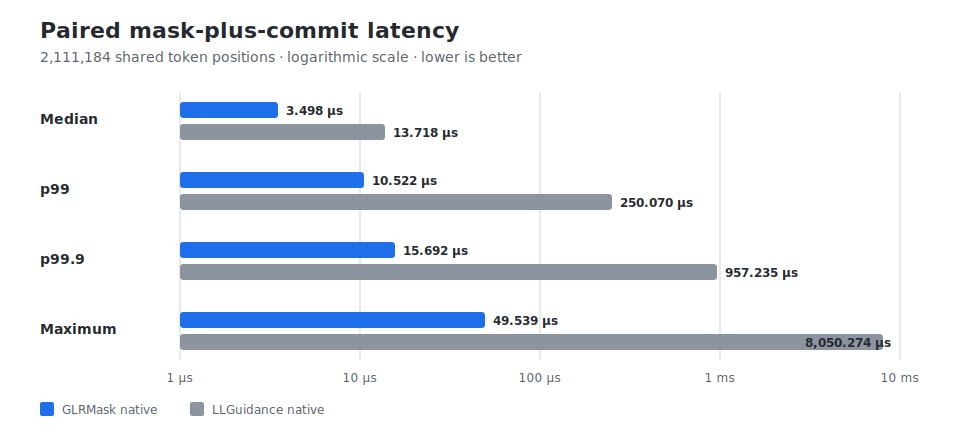

# GLRMask

GLRMask is a grammar-constrained generation library designed for high-throughput decoding. It moves grammar and vocabulary analysis ahead of time wherever possible, minimizing work during generation and keeping next-token mask computation fast and predictable, especially at the tail and for complex grammars.

Compile a grammar or JSON Schema against the exact byte vocabulary of a model, create one state for each generation stream, and query that state before every sample. A token is admitted only when appending its bytes leaves at least one valid completion under the constraint.

GLRMask provides:

- EBNF and Lark grammar input;
- a pragmatic JSON Schema subset for structured generation;
- recursive and ambiguous context-free grammars;
- token-level masking even when model tokens cross lexer or grammar boundaries;
- reusable and serializable compiled constraints;
- Python and Rust APIs.

## Performance at a glance

A completed CFA engineering run covered 10,263 problems. On the exact 2,111,184 token positions shared by GLRMask native and LLGuidance native, the paired mask-plus-commit latency was:

| Paired token latency | GLRMask native | LLGuidance native |
|---|---:|---:|
| Median | **3.498 µs** | 13.718 µs |
| p99 | **10.522 µs** | 250.070 µs |
| p99.9 | **15.692 µs** | 957.235 µs |
| Maximum | **49.539 µs** | 8,050.274 µs |



GLRMask was faster at 99.31% of those shared token positions. The tradeoff was compilation time: median successful build time was 50.963 ms for GLRMask native and 0.905 ms for LLGuidance native.

These are measurements from one recorded engineering run, not hardware-independent guarantees. The run used three GLRMask revisions rather than the immutable public v0.1.0 tag. See the [full benchmark report](docs/benchmark-full-corpus-2026-07-16.md) for coverage, build outcomes, methodology, discrepancy bounds, and interpretation limits.

## Installation

### Python

```bash
python -m pip install glrmask==0.1.0
```

Published wheels contain the native extension. Building from source requires Python, a Rust toolchain, and the platform's native linker and build tools.

### Rust

```bash
cargo add glrmask@0.1.0
```

or add the dependency directly:

```toml
[dependencies]
glrmask = "0.1.0"
```

## Python quickstart

A GLRMask vocabulary maps token IDs to the exact bytes emitted by the tokenizer. This example uses a deliberately small vocabulary; a real integration builds the mapping from the model tokenizer.

```python
import glrmask

vocab = glrmask.Vocab.from_dict({
    b"hello": 0,
    b" ": 1,
    b"world": 2,
})

constraint = glrmask.Constraint.from_ebnf(
    'start ::= "hello" " " "world"',
    vocab,
)
state = constraint.start()

assert state.mask().tolist() == [True, False, False]
state.commit_token(0)

assert state.mask().tolist() == [False, True, False]
state.commit_token(1)

assert state.mask().tolist() == [False, False, True]
state.commit_token(2)

assert state.is_finished()
```

In a model loop, apply the mask before sampling and then commit the sampled token:

```python
mask = state.mask()
logits[~mask] = -float("inf")
token_id = sample(logits)
state.commit_token(int(token_id))
```

`mask()` returns a Boolean NumPy array in the original token-ID space. Serving code that already owns a packed mask buffer can use `fill_mask(...)` instead.

The executable example is in [`examples/python_quickstart.py`](examples/python_quickstart.py).

## Compilation modes

GLRMask exposes two constraint types with the same basic state lifecycle:

| Mode | Compilation strategy | Runtime tradeoff | Best fit |
|---|---|---|---|
| `Constraint` | Performs extensive grammar and vocabulary analysis ahead of time | Fast, tightly bounded mask computation | Reused constraints and throughput-sensitive serving |
| `DynamicConstraint` | Skips much of that precomputation | Faster startup, but slower and less predictable masks | One-shot constraints where initial latency dominates |

In the full-corpus engineering run, `Constraint` had a 50.963 ms median successful build time and a 10.521 µs p99 mask-plus-commit latency. `DynamicConstraint` had a 4.550 ms median successful build time, but a 23.122 ms p99 mask-plus-commit latency over its smaller measured cohort.

The constructors are parallel:

```python
static = glrmask.Constraint.from_json_schema(schema, vocab)
dynamic = glrmask.DynamicConstraint.from_json_schema(schema, vocab)
```

Choose based on the lifetime of the constraint, not compilation time alone. For constraints reused across requests or generation streams, the default ahead-of-time mode is normally the better fit.

## Structured output with JSON Schema

JSON Schema input is useful for tool arguments and other structured outputs:

```python
import glrmask

vocab = glrmask.Vocab.from_dict({
    b'{"action": "': 0,
    b"search": 1,
    b"answer": 2,
    b'"}': 3,
})

schema = r'''
{
  "type": "object",
  "properties": {
    "action": {"enum": ["search", "answer"]}
  },
  "required": ["action"],
  "additionalProperties": false
}
'''

constraint = glrmask.Constraint.from_json_schema(schema, vocab)
state = constraint.start()

assert state.mask().tolist() == [True, False, False, False]
state.commit_token(0)

assert state.mask().tolist() == [False, True, True, False]
state.commit_token(1)

assert state.mask().tolist() == [False, False, False, True]
state.commit_token(3)

assert state.is_finished()
```

JSON Schema support is deliberately pragmatic rather than fully specification-conformant. Unsupported constructs may be rejected, and some documented cases broaden or restrict the accepted instance language to keep compilation tractable. Review [JSON Schema semantic deviations](docs/json-schema-semantic-deviations.md) before relying on exact equivalence to a source schema.

Run the Rust JSON Schema example with:

```bash
cargo run --example json_schema
```

## Token-level mask semantics

Model tokens do not generally line up with lexer tokens or grammar terminals. A single model token may:

- end partway through a grammar terminal;
- complete several terminals;
- cross lexer boundaries;
- produce different terminal sequences from different lexer states.

GLRMask defines admissibility over model tokens. Let `u` be the bytes generated so far, `v` a vocabulary token, `β(v)` its byte spelling, and `L` the compiled language. The mask admits `v` when some continuation `w` exists such that:

```text
u β(v) w ∈ L
```

The guarantee is therefore about completability: every admitted token preserves at least one path to a complete value accepted by the grammar or schema.

## Context-free grammars

GLRMask is not limited to regular constraints. It supports recursive and ambiguous context-free grammars.

For example, the language `a^n b^n` for `n >= 1` requires the number of `b` symbols to match an unbounded number of preceding `a` symbols:

```text
start ::= "a" start "b" | "a" "b"
```

After the first `b` is committed, another `a` is no longer admissible. Generation must close exactly the recursive depth already opened.

Run the complete example with:

```bash
cargo run --example context_free
```

## Grammar inputs

The static and dynamic constraint types accept the same input formats:

```python
from_ebnf = glrmask.Constraint.from_ebnf(ebnf_source, vocab)
from_lark = glrmask.Constraint.from_lark(lark_source, vocab)
from_schema = glrmask.Constraint.from_json_schema(schema_source, vocab)
```

EBNF, Lark, and GLRM grammars can also match an exact model token ID with `@token(<id>)`:

```text
start ::= "hello" @token(128009)
```

The atom matches only that token ID. Its byte spelling does not implicitly match the atom as ordinary grammar text.

## Reusing and serializing constraints

Compiled constraints are immutable and vocabulary-specific. Build one constraint, then create an independent mutable state for each generation stream:

```python
constraint = glrmask.Constraint.from_ebnf(grammar, vocab)

state_a = constraint.start()
state_b = constraint.start()
```

Constraints can be serialized and restored without recompiling the source grammar:

```python
artifact = constraint.save()
restored = glrmask.Constraint.load(artifact, vocab)
state = restored.start()
```

Do not load or reuse a compiled constraint with a different tokenizer vocabulary or token-to-byte mapping.

The repository also contains an execution-only [`glrmask-runtime`](glrmask-runtime) crate for serving processes that load versioned runtime artifacts without carrying the grammar import and compilation pipeline.

## Rust quickstart

The Rust API returns a packed `u32` bitmask. Bit `token_id % 32` in word `token_id / 32` indicates whether a token is admitted.

```rust
use glrmask::{Constraint, Vocab};

fn main() -> Result<(), Box<dyn std::error::Error>> {
    let vocab = Vocab::new(
        vec![
            (0, b"hello".to_vec()),
            (1, b" ".to_vec()),
            (2, b"world".to_vec()),
        ],
        None,
    );

    let constraint = Constraint::from_ebnf(
        r#"start ::= "hello" " " "world""#,
        &vocab,
    )?;

    let mut state = constraint.start();
    let mask = state.mask();
    assert_ne!(mask[0] & 1, 0);
    state.commit_token(0)?;

    Ok(())
}
```

The complete executable example is in [`examples/ebnf.rs`](examples/ebnf.rs):

```bash
cargo run --example ebnf
```

Compiled Rust constraints use `Constraint::save()` and `Constraint::load(...)` for serialization.

## State API

The main incremental operations are:

- `mask()` or `fill_mask(...)` to produce the current token mask;
- `commit_token(token_id)` or `commit_tokens(...)` to advance with sampled tokens;
- `commit_bytes(...)` to advance directly with bytes;
- `force()` to inspect a forced continuation;
- `is_complete()` or `is_finished()` to test whether the current output can terminate.

In v0.1, `is_finished()` is an alias of `is_complete()`.

## Benchmark details

Compilation latency and runtime latency are separate measurements. The default mode deliberately spends more time when a grammar and vocabulary are compiled so that repeated mask queries can reuse that work.

The [10,263-problem full-corpus report](docs/benchmark-full-corpus-2026-07-16.md) records:

- source revisions and framework coverage;
- successful and failed builds;
- build-time and time-to-first-mask distributions;
- mask, commit, and combined per-token latency;
- paired runtime comparisons;
- token-mask discrepancy bounds;
- artifact hashes and reproduction instructions.

The separate [v0.1 benchmark report](docs/benchmark-0.1.md) describes a bounded 195-problem release benchmark target. The two reports use different scopes and should not be treated as interchangeable.

Performance comparisons do not establish semantic equivalence or correctness. Constrained-decoding systems can intentionally expose different token-admissibility policies, so raw mask disagreements require separate language-level analysis.

## Limitations

- **JSON Schema is not fully specification-conformant.** GLRMask supports a pragmatic subset with [documented semantic deviations](docs/json-schema-semantic-deviations.md).
- **Compiled constraints are vocabulary-specific.** Recompile when the tokenizer vocabulary or token-byte mapping changes.
- **Compilation and mask latency are workload-dependent.** Grammar structure, schema features, vocabulary size, hardware, build configuration, and cache state can materially affect both.
- **The full-corpus benchmark is an engineering run, not a release-tag benchmark.** It spans three measured GLRMask revisions and gives dynamic mode a smaller coverage cohort.
- **Direct serving-framework integrations are not included in v0.1.** The release provides the compiler/runtime library and public Python and Rust APIs.

## Examples

```bash
python examples/python_quickstart.py
cargo run --example ebnf
cargo run --example context_free
cargo run --example json_schema
```

## License

Licensed under either the MIT License or the Apache License, Version 2.0, at your option.
