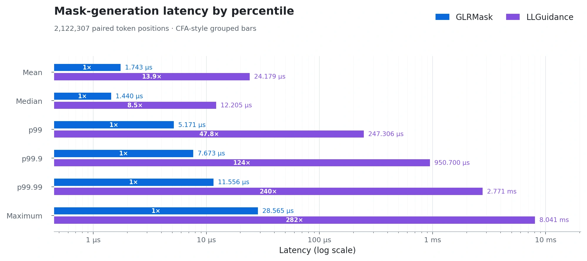
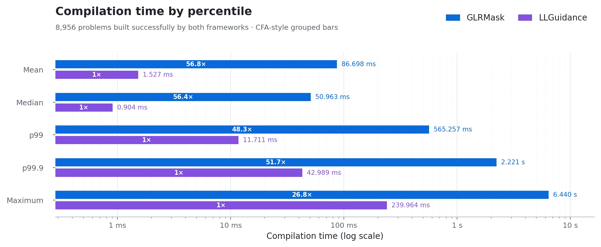

# GLRMask

GLRMask is a grammar-constrained generation library for high-throughput LLM decoding. It is optimized for extremely low next-token mask latency across the distribution, even for complex grammars.

> **Preliminary:** these timings are not yet accurate and should not be relied on.

<p align="center">
  <picture>
    <source media="(prefers-color-scheme: dark)" srcset="docs/assets/benchmark-mask-tail-2026-07-16-dark.webp">
    <source media="(prefers-color-scheme: light)" srcset="docs/assets/benchmark-mask-tail-2026-07-16.webp">
    
  </picture>
</p>

## Installation

### Python

```bash
python -m pip install glrmask
```

Published wheels include the native extension. Building from source requires a Rust toolchain and the platform's native build tools.

### Rust

```bash
cargo add glrmask
```

## Usage

GLRMask compiles a grammar and vocabulary into a `Constraint`. The resulting `Constraint` can be serialized and cached for reuse across requests.

At runtime, call `constraint.start()` to initialize a `ConstraintState`. In the decoding loop, run `state.mask()` in parallel with the model’s forward pass so the mask is ready in time for sampling. Then apply the mask to the logits, sample a token, and call `state.commit_token(token_id)` to advance the state.

```text
state = constraint.start()

while generating:
    in parallel:
        logits = llm.forward(...)
        mask = state.mask()

    logits = apply_mask(logits, mask)
    token_id = sample(logits)
    state.commit_token(token_id)
```

For complex constraints, compilation typically takes a few hundred milliseconds. To minimize cold-start latency on cache miss, use `DynamicConstraint`. It has the same interface as `Constraint` and produces identical masks, but compiles much faster, at the cost of higher mask-generation latency. The corresponding `Constraint` can be compiled separately and cached for subsequent requests.

## Python quickstart

```bash
python -m pip install glrmask llama-cpp-python torch
```

```python
import numpy as np
from llama_cpp import Llama
from torch import from_numpy
from torch.distributions import Categorical

import glrmask


llm = Llama(model_path="model.gguf", logits_all=True)
vocab = glrmask.Vocab.from_llama_cpp(llm)
end_token_ids = vocab.llama_cpp_end_token_ids
end_tokens = set(end_token_ids)

get_logits = lambda: llm.scores[llm.n_tokens - 1]
sample = lambda logits: Categorical(logits=from_numpy(logits)).sample().item()

prompt = "Classify this review: The story dragged badly. Sentiment: "
input_tokens = llm.tokenize(prompt.encode())

MAX_OUTPUT_TOKENS = 64
```

### Without constraints

```python
llm.reset()
llm.eval(input_tokens)

generated = []

for _ in range(MAX_OUTPUT_TOKENS):
    logits = get_logits()
    token = sample(logits)
    llm.eval([token])
    generated.append(token)

    if token in end_tokens:
        break

print(llm.detokenize(generated).decode())
```

### With GLRMask

```python
schema = '{"type":"string","enum":["positive","negative","neutral"]}'
constraint = glrmask.Constraint.from_json_schema(
    schema,
    vocab,
    end_token_ids=end_token_ids,
)

llm.reset()
llm.eval(input_tokens)

state = constraint.start()
generated = []

for _ in range(MAX_OUTPUT_TOKENS):
    logits = get_logits()
    mask = state.mask(llm.n_vocab())
    logits[~mask] = -np.inf

    token = sample(logits)
    llm.eval([token])
    state.commit_token(token)
    generated.append(token)

    if token in end_tokens:
        break

print(llm.detokenize(generated).decode())
```

## Grammar formats

Unfortunately, [there is no universally accepted EBNF dialect.](https://dwheeler.com/essays/dont-use-iso-14977-ebnf.html) In keeping with this tradition, GLRMask includes its own.

GLRM is GLRMask's native, EBNF-like grammar syntax. It supports exact model-token terminals with `@token(<id>)`. GLRMask also accepts Lark and EBNF grammars.

## Special tokens

Use `@token(<id>)` in GLRM, Lark, or EBNF to match an exact model token:

```text
start ::= "hello" @token(128009)
```

Use `end_token_ids` to require one of the specified model tokens after the grammar completes:

```python
constraint = glrmask.Constraint.from_json_schema(
    schema,
    vocab,
    end_token_ids=[128009],
)
```

The state becomes complete only after one of those tokens is committed.

## How it works

GLRMask maintains a GLR parser state for the generated prefix, updating it as tokens are committed. To compute the next-token mask, a precomputed deterministic weighted automaton reads each parser stack one symbol at a time.

Each transition carries a Boolean mask over the model vocabulary. These masks are intersected along each stack traversal and unioned across alternative paths.

## Performance

Measured with MaskBench on the JSONSchemaBench corpus, using the Llama 3 vocabulary on an Intel Core i7-13620H under Ubuntu 24.04/WSL2.

### Mask-generation latency

<p align="center">
  <picture>
    <source media="(prefers-color-scheme: dark)" srcset="docs/assets/benchmark-mask-cfa-bars-2026-07-16-dark.webp">
    <source media="(prefers-color-scheme: light)" srcset="docs/assets/benchmark-mask-cfa-bars-2026-07-16.webp">
    
  </picture>
</p>

### Compilation time

<p align="center">
  <picture>
    <source media="(prefers-color-scheme: dark)" srcset="docs/assets/benchmark-compilation-cfa-bars-2026-07-16-dark.webp">
    <source media="(prefers-color-scheme: light)" srcset="docs/assets/benchmark-compilation-cfa-bars-2026-07-16.webp">
    
  </picture>
</p>

See the [full benchmark report](docs/benchmark-full-corpus-2026-07-16.md) for methodology.

## License

Licensed under either the MIT License or the Apache License, Version 2.0, at your option.
