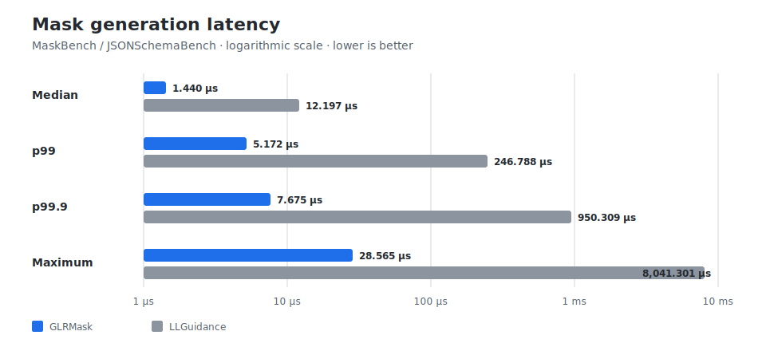

# GLRMask

GLRMask is a grammar-constrained generation library designed for high-throughput decoding. It moves grammar and vocabulary analysis ahead of time wherever possible, minimizing work during generation and keeping next-token mask computation fast and predictable, especially at the tail and for complex grammars.

## Performance

Measured with MaskBench on the JSONSchemaBench corpus, using the Llama 3 vocabulary on an Intel Core i7-13620H under Ubuntu 24.04/WSL2. Engines ran single-threaded; each token timing is the minimum of 20 traversals.

### Mask generation latency

| Latency | GLRMask | LLGuidance |
|---|---:|---:|
| Median | **1.440 µs** | 12.197 µs |
| p99 | **5.172 µs** | 246.788 µs |
| p99.9 | **7.675 µs** | 950.309 µs |
| Maximum | **28.565 µs** | 8,041.301 µs |



### Compilation time

| Latency | GLRMask | LLGuidance |
|---|---:|---:|
| Median | 50.963 ms | **0.905 ms** |
| p99 | 565.006 ms | **11.810 ms** |
| p99.9 | 2,217.617 ms | **42.986 ms** |
| Maximum | 6,440.287 ms | **239.964 ms** |

See the [full benchmark report](docs/benchmark-full-corpus-2026-07-16.md) for the complete setup and results.

## Installation

### Python

```bash
python -m pip install glrmask==0.1.0
```

Published wheels contain the native extension. Building from source requires Python, a Rust toolchain, and the platform's native linker and build tools.

### Rust

```bash
cargo add glrmask@0.1.0
```

or add the dependency directly:

```toml
[dependencies]
glrmask = "0.1.0"
```

## Python quickstart

This example also requires llama-cpp-python and PyTorch:

```bash
python -m pip install llama-cpp-python torch
```

```python
import numpy as np
from llama_cpp import Llama
from torch import from_numpy
from torch.distributions import Categorical

import glrmask


llm = Llama(model_path="model.gguf", logits_all=True)

get_logits = lambda: llm.scores[llm.n_tokens - 1]
sample = lambda logits: Categorical(logits=from_numpy(logits)).sample().item()

prompt = "Classify this review: The story dragged badly. Sentiment: "
input_tokens = llm.tokenize(prompt.encode())

MAX_OUTPUT_TOKENS = 64
```

### Without constraints

```python
llm.reset()
llm.eval(input_tokens)

generated = []

for _ in range(MAX_OUTPUT_TOKENS):
    logits = get_logits()
    token = sample(logits)
    llm.eval([token])
    generated.append(token)

    if token == llm.token_eos():
        break

print(llm.detokenize(generated).decode())
```

### With GLRMask

```python
vocab = glrmask.Vocab.from_id_to_bytes({
    token: llm.detokenize([token], special=True)
    for token in range(llm.n_vocab())
})

schema = '{"type":"string","enum":["positive","negative","neutral"]}'
constraint = glrmask.Constraint.from_json_schema(schema, vocab)

llm.reset()
llm.eval(input_tokens)

state = constraint.start()
generated = []

for _ in range(MAX_OUTPUT_TOKENS):
    logits = get_logits()
    mask = state.mask()
    logits[~mask] = -np.inf

    token = sample(logits)
    llm.eval([token])
    state.commit_token(token)
    generated.append(token)

    if token == llm.token_eos():
        break

print(llm.detokenize(generated).decode())
```

### With forced tokens

`force()` returns a deterministic continuation without advancing the constraint. Each returned token is committed to both the model and the constraint.

```python
llm.reset()
llm.eval(input_tokens)

state = constraint.start()
generated = []
token = None

while token != llm.token_eos() and len(generated) < MAX_OUTPUT_TOKENS:
    logits = get_logits()
    mask = state.mask()
    logits[~mask] = -np.inf

    token = sample(logits)
    llm.eval([token])
    state.commit_token(token)
    generated.append(token)

    if token == llm.token_eos():
        break

    for token in state.force():
        llm.eval([token])
        state.commit_token(token)
        generated.append(token)

        if token == llm.token_eos():
            break

print(llm.detokenize(generated).decode())
```

## Compilation modes

`Constraint` performs grammar and vocabulary analysis ahead of time and is intended for constraints reused across requests.

`DynamicConstraint` compiles faster but performs more work during each mask query. It is intended for one-off constraints where startup latency matters more than runtime latency.

| Mode | Median compilation | p99 TBM | Maximum TBM |
|---|---:|---:|---:|
| `Constraint` | 50.963 ms | **10.521 µs** | **49.539 µs** |
| `DynamicConstraint` | **4.550 ms** | 23.122 ms | 323.609 ms |

Dynamic mode was measured on a smaller cohort.

```python
static = glrmask.Constraint.from_json_schema(schema, vocab)
dynamic = glrmask.DynamicConstraint.from_json_schema(schema, vocab)
```

## JSON Schema

GLRMask implements a pragmatic subset of JSON Schema. Unsupported constructs may be rejected, and some documented cases broaden or restrict the accepted instance language. See [JSON Schema semantic deviations](docs/json-schema-semantic-deviations.md).

## Rust quickstart

The Rust API returns a packed `u32` bitmask. Bit `token_id % 32` in word `token_id / 32` indicates whether a token is admitted.

```rust
use glrmask::{Constraint, Vocab};

fn token_allowed(mask: &[u32], token_id: usize) -> bool {
    let word = token_id / 32;
    word < mask.len() && ((mask[word] >> (token_id % 32)) & 1) != 0
}

fn main() -> Result<(), Box<dyn std::error::Error>> {
    let vocab = Vocab::new(
        vec![
            (0, b"hello".to_vec()),
            (1, b" ".to_vec()),
            (2, b"world".to_vec()),
        ],
        None,
    );

    let constraint = Constraint::from_ebnf(
        r#"start ::= "hello" " " "world""#,
        &vocab,
    )?;

    let mut state = constraint.start();

    assert!(token_allowed(&state.mask(), 0));
    state.commit_token(0)?;

    assert!(token_allowed(&state.mask(), 1));
    state.commit_token(1)?;

    assert!(token_allowed(&state.mask(), 2));
    state.commit_token(2)?;

    assert!(state.is_finished());

    Ok(())
}
```

Run the repository example with:

```bash
cargo run --example ebnf
```

## Other inputs and serialization

Lark grammars use the corresponding constructor:

```python
constraint = glrmask.Constraint.from_lark(lark_source, vocab)
```

EBNF, Lark, and GLRM grammars can match an exact model token ID with `@token(<id>)`:

```text
start ::= "hello" @token(128009)
```

Compiled constraints can be serialized and restored:

```python
artifact = constraint.save()
restored = glrmask.Constraint.load(artifact, vocab)
state = restored.start()
```

Rust provides `Constraint::save()` and `Constraint::load(...)`.

The [`glrmask-runtime`](glrmask-runtime) crate loads versioned runtime artifacts without including the grammar import and compilation pipeline.

## Limitations

- GLRMask implements a pragmatic subset of JSON Schema with [documented semantic deviations](docs/json-schema-semantic-deviations.md).
- Compilation time and mask latency depend on the grammar, schema, vocabulary, hardware, build configuration, and cache state.
- The full benchmark spans three GLRMask revisions, and dynamic mode was measured on a smaller cohort.
- Direct integrations with serving frameworks are not included in v0.1.

## License

Licensed under either the MIT License or the Apache License, Version 2.0, at your option.
