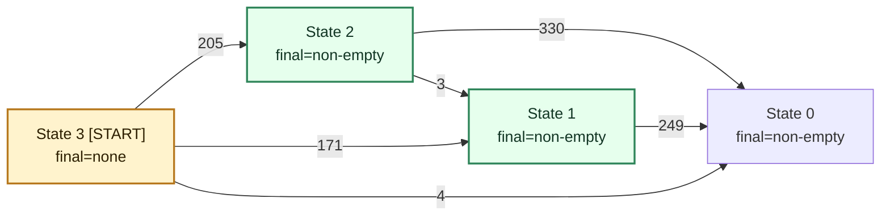

# Terminal DWA Structure: `Kubernetes---kb_684_Normalized`

This diagram shows the minimized terminal DWA for the slowest example.

## Readout

- `State 3` is the only non-final state and acts as the root dispatch node.
- `State 0` is the terminal sink: it is final and has no outgoing transitions.
- `State 1` always funnels into `State 0`.
- `State 2` mostly funnels into `State 0`, with only `3` transitions going to `State 1`.
- There are no self-loops and no transitions back to the start state.
- The longest path is `State 3 -> State 2 -> State 1 -> State 0`.
